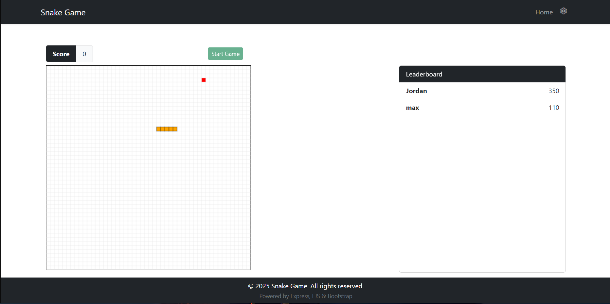

## Project Overview

his project is an interactive Snake Game Web Application developed using HTML5 Canvas, JavaScript, Bootstrap, and Node.js for server-side leaderboard handling. The game recreates the classic Snake experience with modern enhancements including a color customization setting, a start/restart flow using modals, and a persistent leaderboard.

Players control the snake using arrow keys or WASD, trying to collect food and grow without colliding with the walls or themselves. The game only starts when the Start Game button is pressed, and ends with a smooth Game Over modal, allowing the player to submit their name to a leaderboard stored server-side.

Key features include:

Customizable Snake Color from a settings dropdown in the navbar.

Start Button control to delay gameplay until the player initiates.

Game Over & Play Again Flow using Bootstrap modals.

Persistent Leaderboard using Node.js and Express server endpoints.

Live Score Display with styled UI using Bootstrap components.

Responsive Canvas and Layout suitable for various screen sizes.

## Technologies Used

The following technologies were utilized in the development of this project:
* HTML5 Canvas (for game rendering)
* Node.js (v22+)
* Express.js (v5+)
* EJS (v3+)
* Mongoose (v8+)
* CSS / Bootstrap 5
* Git & GitHub
* nodemon (for live development)

## Screenshots 

Below are screenshots demonstrating the key pages and functionalities of the Community Portal:

* **Home Page:**
    

* **Error Page:**
    
    
* **Game Start:**
    

## Online Hosting Link

Not hosted yet