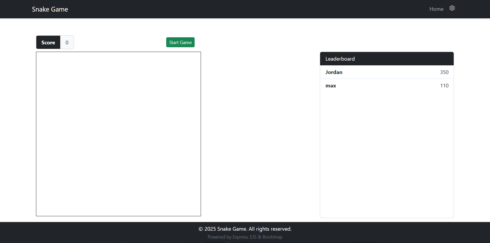
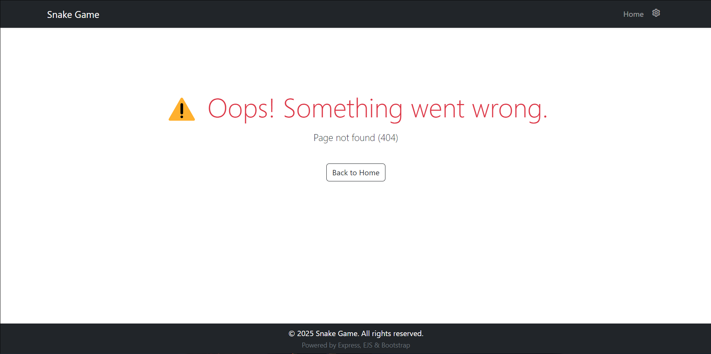

snake-game-web/
│
├── package.json
├── app.js                  # Main Express application
├── .env                   # Environment variables (if needed)
├── README.md              # Project documentation
│
├── 📁public/               # Static files served by Express
│   ├── 📁css/
│   │   └── styles.css      # Custom styles (Bootstrap overrides or additions)
│   ├── 📁js/
│   │   └── game.js         # Snake game logic using Canvas
│   ├── 📁img/
│   │   └── ...             # Any static images (e.g. icons, logos)
│   └── 📁vendor/           # Optional: local Bootstrap or other third-party libraries
│
├── 📁routes/
│   └── index.js            # Main route (handles GET for game page)
│
├── 📁views/                # EJS templates
│   ├── 📁partials/
│   │   ├── header.ejs      # Reusable header (e.g., Bootstrap navbar)
│   │   └── footer.ejs      # Reusable footer
│   └── index.ejs           # Main game page template with canvas element
│
└── 📁utils/                # Optional: utility functions
    └── gameLogic.js        # Optional game state logic on server (e.g., scoreboards)

## Project Overview

This project is a Dynamic Weather Forecast Web Application developed using Node.js, Express.js, EJS, and Bootstrap. The application allows users to retrieve and view a 5-day weather forecast for any city, with dynamically rendered content and responsive design.

Users can search for a city using a text input. Upon selecting a location, the app fetches detailed weather data using the OpenWeather 5-Day Forecast API and displays it in a user-friendly format using Bootstrap cards, or if on the hourly page fetches a 5 day, 3-hourly forecast grouped by day. The interface includes a unit toggle switch in the navbar, enabling real-time switching between Celsius and Fahrenheit.

Key features include:

- Live weather forecast for selected cities.

- Grouped daily forecast display with responsive cards.

- Celsius/Fahrenheit toggle with instant UI update.

- Error handling and user-friendly fallback messaging.

## Technologies Used

The following technologies were utilized in the development of this project:
* Node.js (v22+)
* Express.js (v5+)
* EJS (v3+)
* Axios (v1+)
* CSS / Bootstrap 5
* Git & GitHub
* nodemon (for live development)

## Screenshots 

Below are screenshots demonstrating the key pages and functionalities of the Community Portal:

* **Home Page:**
    

* **Error Page:**
    
    

## Online Hosting Link

Not hosted yet